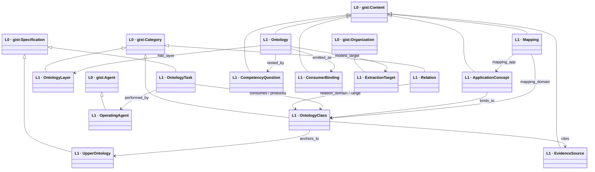
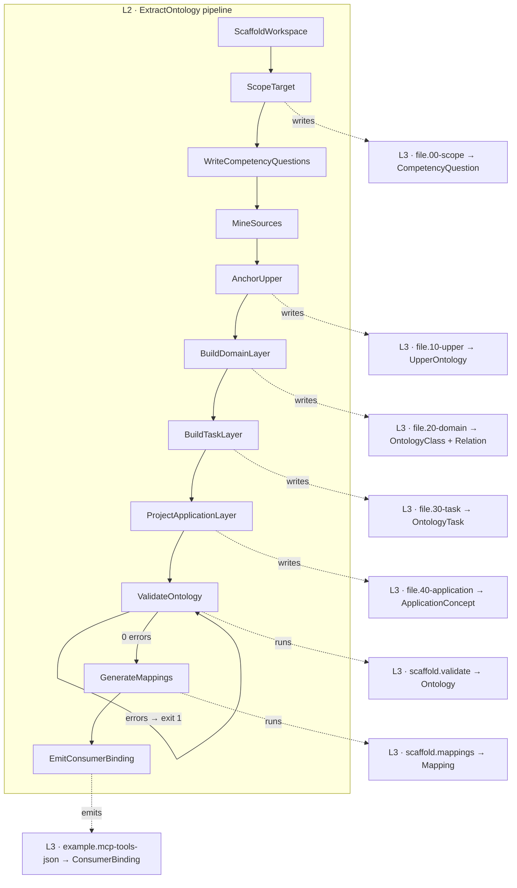

# Review diagrams — ontologyex self-ontology

Emitted from `20-domain.yaml` + `30-task.yaml` + `40-application.yaml` per
`references/output-formats.md` (§6 Mermaid). Split into two views to stay under ~25 nodes each:
the **domain spine** (L0 anchoring + L1 relations) and the **workflow + L3 binding** view.

## 1. Domain spine — L0 anchors ↑ L1 classes ↓ relations

## 2. Workflow (L2) + application binding (L3)

The umbrella `ExtractOntology` decomposes into 11 leaf tasks; each writes one file artifact (L3)
and one becomes one MCP tool. L2 tasks shown as the pipeline; L3 artifacts as the files they touch.

