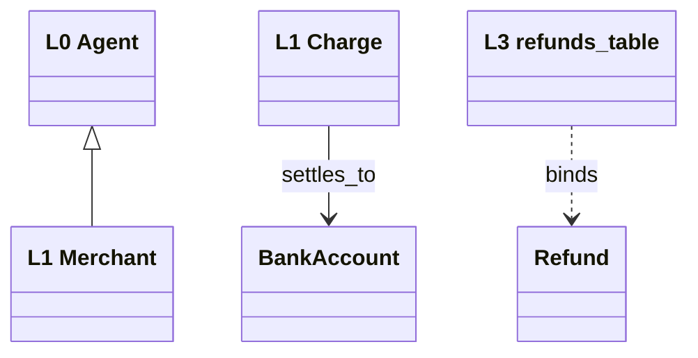

# Output Formats & Consumer Bindings

## Canonical working format (YAML, hand-editable, validator-checked)

### 10-upper.yaml
```yaml
source_ontology: gist          # gist | bfo+cco | dolce | sumo | schema.org | custom-minimal
version: "current"             # pin the actual version you fetched
anchors:
  - id: Agent
    iri: "https://w3id.org/semanticarts/ns/ontology/gist/Agent"
    note: "Anything that can act: person, org, software agent"
  - id: Event
    iri: "https://w3id.org/semanticarts/ns/ontology/gist/Event"
  - id: PhysicalThing
    iri: "..."
  - id: InformationArtifact
    iri: "..."
  - id: Role
    iri: "..."
```

### 20-domain.yaml
```yaml
classes:
  - id: Merchant
    definition: "Business entity that accepts payments for goods or services."
    upper: Agent                        # must exist in 10-upper.yaml anchors
    synonyms: [Seller, Vendor]
    aligns_to: "https://schema.org/Organization"
    alignment: subClassOf
    source: "https://stripe.com/docs/glossary"
  - id: Charge
    definition: "A single attempt to move funds from a payer to a merchant."
    upper: Event
    source: "API docs /v1/charges"

relations:
  - id: settles_to
    definition: "Funds from a charge land in a bank account."
    domain: Charge                      # must exist in classes
    range: BankAccount
    cardinality: many-to-one            # one-to-one | one-to-many | many-to-one | many-to-many
    source: "payout docs"
```

### 30-task.yaml
```yaml
tasks:
  - id: ProcessRefund
    verb_phrase: "process a refund against a settled charge"
    actor_roles: [SupportAgent]          # L1 classes (Roles)
    inputs: [Charge]                     # L1 classes
    outputs: [Refund]                    # L1 classes
    preconditions: ["Charge is settled", "Refund amount <= Charge amount"]
    effects: ["Refund created", "Merchant balance decreased"]
    decomposes_to: [ValidateEligibility, ReverseTransfer]   # other task ids, optional
    source: "API: POST /v1/refunds"
```

### 40-application.yaml
```yaml
system: "acme-payments-service"
concepts:
  - id: refunds_table
    kind: db_table        # db_table | api_type | tool_schema | event | ui_object
    binds: Refund         # must exist in 20-domain classes
    used_by_tasks: [ProcessRefund]
    fields:
      - name: amount_cents
        maps_to: "Refund.amount"
    source: "migrations/0042_refunds.sql"
  - id: refund.created
    kind: event
    binds: Refund
    used_by_tasks: [ProcessRefund]
    source: "src/events.ts"
```

### 50-mappings.yaml (generated by `scaffold.py mappings`, or maintained by hand)
```yaml
mappings:
  - app: refunds_table
    domain: Refund
    upper: Event
    evidence: "migrations/0042_refunds.sql"
```

## Consumer bindings — emit AFTER validation passes

### 1. Agent tool surface (MCP) — derive tools from L2
Each task with concrete inputs/outputs becomes a tool. Mechanical translation:
```json
{
  "name": "process_refund",
  "description": "Process a refund against a settled charge. Preconditions: charge is settled; refund amount <= charge amount. Effects: refund created, merchant balance decreased.",
  "inputSchema": {
    "type": "object",
    "properties": {
      "charge_id": { "type": "string", "description": "Charge (L1) — the settled charge to refund" },
      "amount_cents": { "type": "integer" }
    },
    "required": ["charge_id"]
  }
}
```
Rules: task `verb_phrase` + preconditions + effects → description (the LLM reads this — preconditions in the description prevent bad calls); inputs → required params typed via the L3 field mappings; one tool per leaf task (tasks with `decomposes_to` become orchestration, not tools).

### 2. Knowledge graph
- **RDF**: emit Turtle (below). Node = L1 class instance, edge = relation, `rdf:type` chains to L0 IRIs.
- **Labeled property graph** (Neo4j etc.): node labels = L1 class ids, relationship types = relation ids UPPER_SNAKE, properties from L3 field mappings. Keep the L0 anchor as a node property `upper: "Event"` for cheap meta-queries.

Turtle emission template:
```turtle
@prefix : <https://example.com/ontology/acme#> .
@prefix gist: <https://w3id.org/semanticarts/ns/ontology/gist/> .
@prefix owl: <http://www.w3.org/2002/07/owl#> .
@prefix rdfs: <http://www.w3.org/2000/01/rdf-schema#> .
@prefix skos: <http://www.w3.org/2004/02/skos/core#> .

:Merchant a owl:Class ;
    rdfs:subClassOf gist:Agent ;
    rdfs:subClassOf <https://schema.org/Organization> ;
    skos:definition "Business entity that accepts payments for goods or services." ;
    skos:altLabel "Seller", "Vendor" .

:settles_to a owl:ObjectProperty ;
    rdfs:domain :Charge ;
    rdfs:range :BankAccount .
```

### 3. Web/API payloads — JSON-LD @context
Keeps L3 JSON keys mapped to L1/L0 IRIs without changing the payloads:
```json
{
  "@context": {
    "@vocab": "https://example.com/ontology/acme#",
    "merchant": { "@id": "Merchant", "@type": "@id" },
    "amount_cents": "Refund.amount"
  }
}
```
If the consumer is public web / LLM crawlers, prefer schema.org terms directly in the context.

### 4. Code types — L3 → TypeScript/Pydantic
Emit one type per L3 concept; docstring carries the L1 binding so the mapping survives in-code:
```typescript
/** L3: refunds_table — binds L1:Refund (L0:Event). Source: migrations/0042 */
interface RefundRow {
  amount_cents: number;  // maps_to Refund.amount
}
```

### 5. RAG metadata
L1 classes become the metadata filter vocabulary: tag chunks with `domain_class`, `task` (if the chunk describes a procedure), and `upper`. Queries route on L1; L2 tags separate "what is X" chunks from "how to do X" chunks — the distinction most RAG setups miss.

### 6. Review diagram — Mermaid

Render L0 at top, L1 middle, L3 bottom, L2 as notes on the relations they use. Keep under ~25 nodes per diagram; split by subdomain past that.

## Default deliverable decision

| Consumer stated | Emit |
|---|---|
| "agents" / "tools" / MCP | YAML set + MCP tool JSON |
| "knowledge graph" | YAML set + Turtle (RDF) or LPG mapping note |
| "database/API" | YAML set + TS/Pydantic types + JSON-LD context |
| "just understand the business" | YAML set + Mermaid + prose summary |
| unspecified | YAML set + Mermaid; ask before emitting more |
